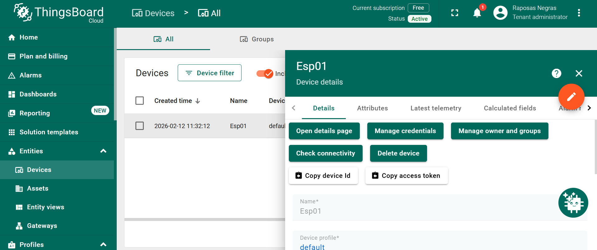

# Tutorial-de-como-usar-ESP01-com-thingsboard
Repositório desenvolvido por Maria Clara Nadim Martiniano e Ismael Ritchard da Silva, apresentando um guia completo de integração do módulo ESP-01 (ESP8266) com a plataforma ThingsBoard Cloud. O projeto inclui configuração do dispositivo, implementação do código-fonte, esquemas de ligação e envio de telemetria via protocolo MQTT.

## Materiais necessários:
- ESP-01 (ESP8266)
- Microcontrolador (usada no tutorial foi STM32 Nucleo-F401RE)
- Protoboard
- Adaptador USB
- Arduino IDE
- Conta no ThingsBoard
- Potenciometro B100k

## Parte 1 - Montagem física
### Ligações da ESP-01
Para a montagem da ESP-01 na F401RE é importante que o RX da ESP esteja ligado no TX da NUCLEO, enquanto que o TX da ESP esteja no RX da NUCLEO. A montagem a seguir é o exemplo utilizado, mas pode ter variações.  
  
**ESP-01**--------|---**NUCLEO**  
RX-------------|---TX (Usado no exemplo: PA9)  
TX-------------|---RX (Usado no exemplo: PA10)  
VCC-----------|---3.3V  
GND----------|---GND  
CH_PD--------|---3.3V  
Demais Pinos-|---Não precisa ligar  

### Ligações do potenciômetro
O potenciômetro utilizado não possui pinos específicos 100% limitados, porém é importante que os pinos das extremidades estejam ligados na fonte e no GND, enquanto o pino central esteja ligado à entrada analógica da placa. Portanto, segue o exemplo utilizado:  
  
**POTENCIÔMETRO**   -|---   **NUCLEO**  
Pino 1---------------|   ---5V  
Pino 2---------------|   ---PA4  
Pino 3---------------|   ---GND  

## Parte 2 - Software
### Software da ESP-01
O software da ESP-01 foi desenvolvido no Arduino e o código está disponibilizado neste material. Para fazer bom uso do material fornecido, alguns trechos do código foram deixado para ser preenchidos pelo leitor do tutorial, sendo eles: nome do wifi em que a ESP deve se conectar, senha do wifi em que a ESP deve se conectar e token do device do thingsboard que estará explicado mais abaixo como encontrar.
Em resumo, o código disponibilizado deve ser carregado na ESP-01 através de módulo disponível no LSM. Este código por si só permite que a ESP-01 se conecte ao wifi desejado e ao device do thingsboard. Para validar a conexão, é possível abrir o monitor serial do Arduino com a ESP-01 ainda ligada ao computador via USB, pressionar o reset da ESP e verificar se a conexão wifi está ocorrendo corretamente.

### Software da NUCLEO
O software da Nucleo também foi disponibilizado como exemplo. Neste arquivo, ao entrar em core/src/main.c, é possível identificar a variável criada para leitura do potenciômetro, o código da leitura em si, a formatação da leitura feita para JSON de modo que possa ser enviada pela ESP e o código que permite o envio do valor através da ESP. Vale ressaltar que neste exemplo foi usado um potenciômetro mas qualquer sensor, botão, contagem e etc poderia ser utilizado, depende apenas da sua necessidade e criatividade. De mesmo modo, podem também ser utilizados outros modelos de cards, gráficos e etc no thingsboard, conforme será mostrado posteriormente, podendo se alinhar também ao seu uso.

## Parte 3 - Configuração no ThingsBoard
### Acessar a aba Devices
No menu lateral, clique em **Devices** para visualizar os dispositivos cadastrados.

---
### Adicionar novo dispositivo

Clique no botão **+ Add device** no canto superior direito.

Na janela que abrir:
- Preencha o campo **Name** (ex: ESP01)
- Mantenha o **Device profile** como `default`
- Clique em **Add**

---

### Abrir detalhes do dispositivo

Após criar o dispositivo, clique sobre o nome dele (ESP01).
Na tela de detalhes, clique em: **Copy access token**
Esse **token** será utilizado no código do ESP-01 para autenticação na plataforma.

---
### Confirmar dispositivo ativo
Após a criação, o dispositivo aparecerá na lista com o status **Active**.
Isso indica que o dispositivo está cadastrado corretamente e pronto para receber dados.

---
## Importante

O **Access Token** copiado no Passo 3 deve ser inserido no código do ESP-01:
